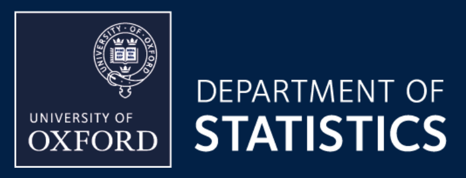

# Doctor of Philosophy Thesis

PDF File of thesis submitted in Autumn 2010 for the title *Doctor of Philosophy*

Title: Ordinal classification via Support Vector Machines applied to Soccer outcomes and assessed by gambling strategies

Awarding Body: [University of Oxford](http://www.ox.ac.uk/)

Faculty: [Oxford Mathetmatical Sciences](https://www.maths.ox.ac.uk/)

Department: [Department of Statistics](https://www.stats.ox.ac.uk/) 

Supervisor: [Professor Brian D. Ripley](http://www.stats.ox.ac.uk/~ripley/) and his [wikipedia entry](https://en.wikipedia.org/wiki/Brian_D._Ripley) 

PhD Committee: [Professor Jonathan Marchini](https://jmarchini.org/), [Professor Nicholas Meinhausen](https://stat.ethz.ch/~nicolai/), [Professor Geoff Nicholls](http://www.stats.ox.ac.uk/~nicholls/), [Professor Charles Taylor](https://physicalsciences.leeds.ac.uk/staff/84/professor-charles-taylor)

## Abstract

### Ordinal classification via Support Vector Machines applied to Soccer outcomes and assessed by gambling strategies

Gambling on handicapped sports events lends itself naturally to being modelled as an ordinal classification task. In this work we show how to use ordinal classifiers to generate accurate estimates of predictive
class probabilities for an artificial example and European Soccer data. A review of statistical and machine learning strategies for ordinal classification is used to build an algorithm which explicitly accounts
for non-linearity via Support Vector Machines, RankingSVM. We note that a sophisticated loss function is needed to properly deal with ordinal data modelling.

Using RankingSVM and Bayesian POLR models we demonstrate that a complex dataset of Soccer-related variables can be used to estimate the odds of betting related events which are consistent with market odds.

To transform this into a profitable strategy we investigate gambling strategies based on stochastic programming. These strategies have led us to develop a non-parametric comparison and visualizations for the predictive ability of multinomial and by extension ordinal classification models.